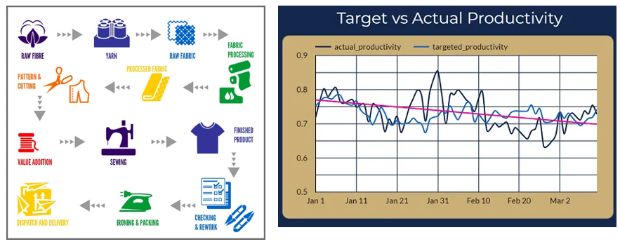

## Style Analysis Efficient Swingline Planning

 

 

# Garment and Swing Factory Optimization Software

In a garments product there the different types of style like pant one style shirt another style in different type of style there have multiple process and every process have its different types of setup machine, accessories etc.
In this scenario if we can swing same type of product or style sequentially it will help to gain production efficiency.

## Features

1. **Style Comparison**
   - Our software enables users to compare different garment styles effortlessly.
   - It identifies fully matched processes, partially matched processes based on machine and accessory requirements, and processes that do not match.

2. **Similarity Matching Matrix Generation**
   - With our software, generating a matrix of multiple style matching.
   - This feature allows for efficient planning of production loads, ensuring optimal utilization of resources.

3. **Line Loading Sequencing**
   - Automate your production line loading sequence with ease.
   - Our software intelligently generates the sequence based on similarity matching, optimizing workflow and minimizing downtime.

4. **Combination Analysis**
   - In between different types of style it will show all possible types of combinations to load styles in swing line or plan in an efficient way.

5. **Multi-Line Analysis**
   - Helps to plan and arrange between multiple lines based on previous production matching for optimal planning.

## Benefits

- **Enhanced Efficiency:** By accurately matching styles with compatible processes and accessories, our software significantly improves workflow efficiency.
- **Increased Productivity:** Streamlining production line loading sequences and planning through style matching results in enhanced productivity and output.
- **Reduced Downtime:** Minimize downtime by automating the identification of matching processes, thereby ensuring continuous operation of the production line.
- **Improved Resource Utilization:** Optimize the allocation of resources, including machinery and manpower, by effectively planning production loads based on style matching matrices.

In summary, our Garment and Swing Factory Optimization Software offers a holistic solution to the complex challenges faced by garment factories. With its intuitive features and advanced algorithms, it empowers manufacturers to achieve unprecedented levels.

<h4>
In a garments there are lots of styles are swing every time so it is very important to put the style in swing line very carefully. If we can run similar styles in a sequence than the swing efficiency will be increase and stable.
suppose planer have some style they need to plan those style in swing line in that case if planer can pan the styles in most similar way than the efficiency will be all time increase.
</h4>

<h2>In a style there are lots of information :<h2>

